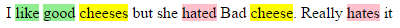
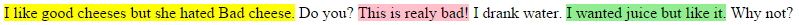
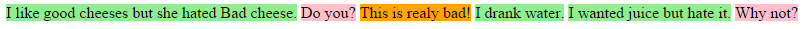

```{r, echo=FALSE}
desc <- suppressWarnings(readLines("DESCRIPTION"))
regex <- "(^Version:\\s+)(\\d+\\.\\d+\\.\\d+)"
loc <- grep(regex, desc)
ver <- gsub(regex, "\\2", desc[loc])
verbadge <- sprintf('<a href="https://img.shields.io/badge/Version-%s-orange.svg"></a></p>', ver, ver)
````

[](https://travis-ci.org/trinker/hilight)
[](https://coveralls.io/r/trinker/hilight?branch=master)
`r verbadge`

**hilight** is an **R** package to allow for easier highlighting of text substrings as an HTML file.  

# Usage

The user goes through the following process:

1. Generate a template via `highlight_template` with css markup for `mark` tags with classes and colors
2. Generate a body using the `mark` family of functions (more below)
3. Insert the body into `highlight_template` output with `insert_body`
4. Generate an HTML file with `tempalte2html`

The user can generate a highlight marked body character vector to insert into the html document using four functions:

| Function         |  Description                                          |
|------------------|-------------------------------------------------------|
| `mark_words`      | Highlight specific words                       |
| `mark_word_stems`      | Highlight word stems                       |
| `mark_regex`   | Highlight by regex                     |
| `mark_sentences`   | Highlight sentences by `grepl`                      |

These mark functions markup the body string with html `mark` tags with a class that was supplied to `highlight_template`.  These also correspond to a color in the css in the `highlight_template` output.

# Installation

To download the development version of **hilight**:

Download the [zip ball](https://github.com/trinker/hilight/zipball/master) or [tar ball](https://github.com/trinker/hilight/tarball/master), decompress and run `R CMD INSTALL` on it, or use the **pacman** package to install the development version:

```r
if (!require("pacman")) install.packages("pacman")
pacman::p_load_gh("trinker/hilight")
```
# Examples

First and foremost the user will want to markup some content to insert into the template body.  The following examples show how to mark up the content and generate a highlighted HTML document.

## Mark Words

Highlight specific words.  Also note the **dplyr** syntax that may make ordering a bit more understandable.  Notice that we generate highlighted content and then put that into an HTML template.

```{r, eval=FALSE}
x <-"I like good cheese but hate Bad cheese"
words <- c("cheese", "like", "good", "bad")
marks_class <- c("neutral", "pos", "pos", "neg")
marks <- c(pos = "lightgreen", neg = "pink", neutral = "yellow")
body <- mark_words(x, words, marks_class)

## To an external file
template2html(insert_body(highlight_template(marks), body))
open_html()

## dplyr Syntax
library(dplyr)

marks %>%
    highlight_template() %>%
    insert_body(body) %>%
    template2html()

open_html()
```


## Mark Word Stems

Highlight word stems. For example `cheese` matches "cheese" and "cheeses".  Give the shortest possible substring as a stem.

```{r, eval=FALSE}
x <-"I like good cheeses but she hated Bad cheese"
stems <- c("cheese", "like", "good", "bad")
marks_class <- c("neutral", "pos", "pos", "neg")
marks <- c(pos = "lightgreen", neg = "pink", neutral = "yellow")
body <- mark_word_stems(x, stems, marks_class)

## To an external file
template2html(insert_body(highlight_template(marks), body))
open_html()
```


## Mark Regex

Highlight based on regexes.  Ths is the most flexible but takes knowledge of regular expressions.

```{r, eval=FALSE}
x <-"I like good cheeses but she hated Bad cheese.  Really hates it"
regex <- c("chees[^ ]*\\b", "like", "hate[^ ]*\\b", "good", "bad\\b")
marks_class <- c("neutral", "pos", "neg", "pos", "neg")
marks <- c(pos = "lightgreen", neg = "pink", neutral = "yellow")

body <- mark_regex(x, regex, marks_class)

## To an external file
template2html(insert_body(highlight_template(marks), body))
open_html()
```



## Mark Sentences

Highlight sentences if they meet a condition (If multiple conditions are met the first condition that is met will be highlighted).  This essentially splits content into sentences and uses a `grepl` to determine if a condition is met.

### Example 1: Words

```{r, eval=FALSE}
x <- c("I like good cheeses but she hated Bad cheese.  Do you?",
    "This is realy bad!", "I drank water.  I wanted juice but like it. Why not?")

regex <- c("chees[^ ]*\\b", "like", "hate[^ ]*\\b", "good", "bad\\b")
marks_class <- c("neutral", "pos", "neg", "pos", "neg")
marks <- c(pos = "lightgreen", neg = "pink", neutral = "yellow")

body <- mark_sentences(x, regex, marks_class)

## To an external file
template2html(insert_body(highlight_template(marks), body))
open_html()
```



### Example 2: End Marks

```{r, eval=FALSE}
regex <- c("\\.$", "\\?$", "\\!$")
marks_class <- c("statment", "question", "exclamation")
marks <- c(statment = "lightgreen", question = "pink", exclamation = "orange")

body <- mark_sentences(x, regex, marks_class)

## To an external file
template2html(insert_body(highlight_template(marks), body))
open_html()
```



# Contact

You are welcome to:
* submit suggestions and bug-reports at: <https://github.com/trinker/hilight/issues>
* send a pull request on: <https://github.com/trinker/hilight/>
* compose a friendly e-mail to: <tyler.rinker@gmail.com>
